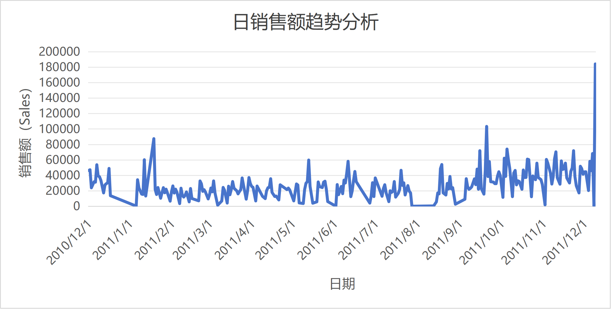
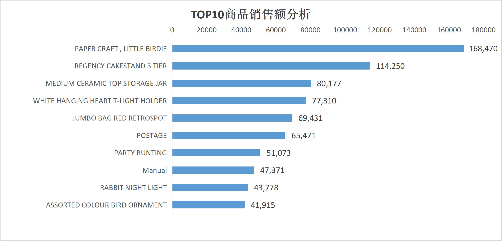
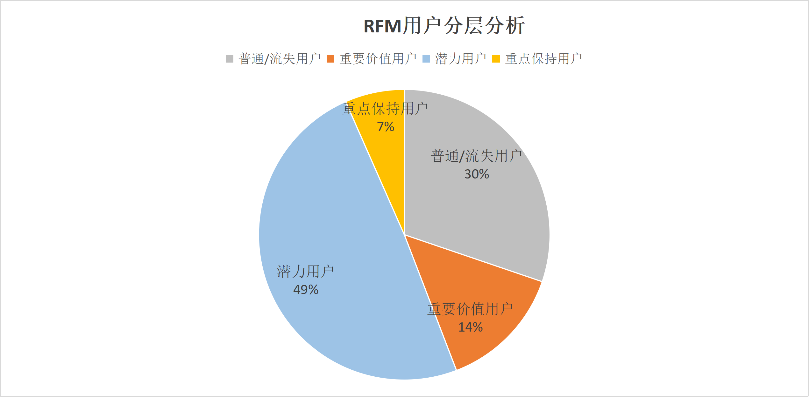

# 电商用户行为分析项目

## 项目简介
基于 Online Retail 电商数据集，对用户消费行为、销售趋势及用户价值进行分析。

## 技术栈
MySQL / Excel / 数据清洗 / 可视化 / RFM模型

## 文件结构
- 数据/: 数据源和导出文件
- SQL/: 查询脚本
- 图表/: 分析图表
- 报告/: 项目报告
- README.md: 项目说明

## 项目成果
- 日销售趋势分析
- TOP10商品销售分析
- 用户复购率与客单价分析
- RFM用户价值分层分析

# Daily Sales Trend

# TOP10 Products

# RFM Analysis

